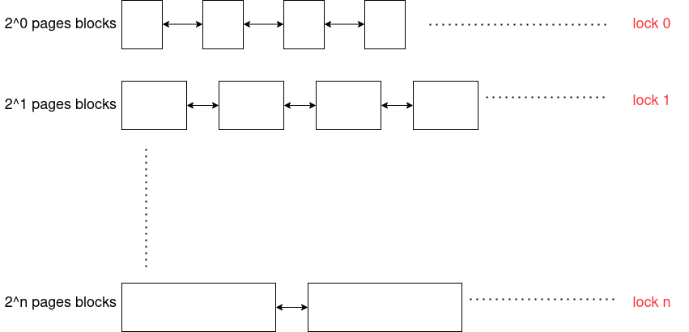
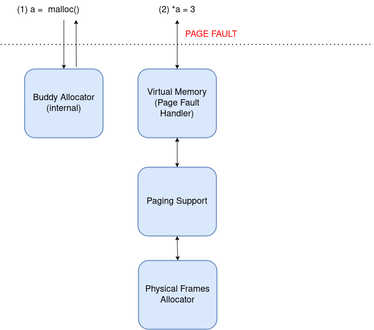
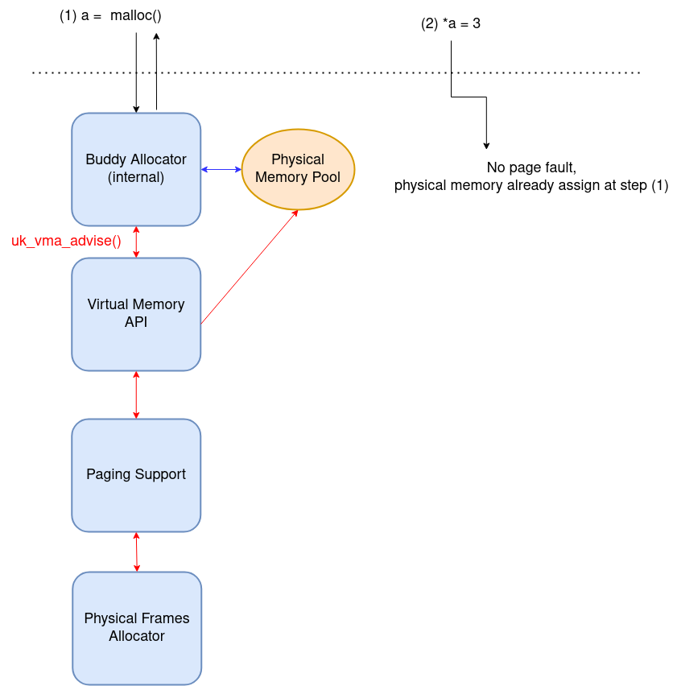
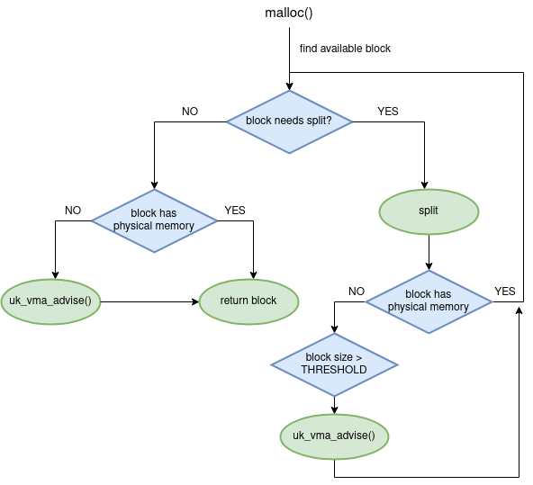
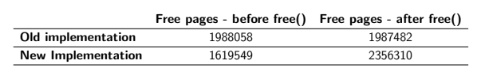
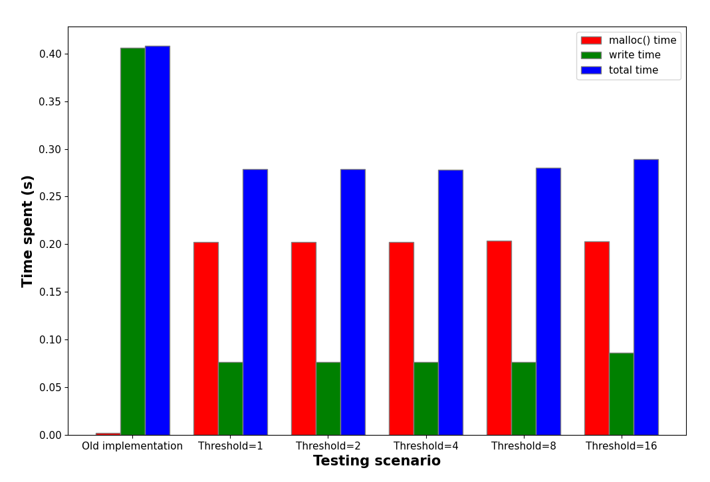

The Unikraft memory management underwent some interesting transformations in the last year.
From a simplistic approach where a buddy allocator directly manages blocks of physical memory, we got to a system that provides [paging](https://unikraft.org/blog/2022-08-20-unikraft-releases-phoebe/#paging-support-on-arm64-according-to-vmsav8-64) and [virtual memory support](https://unikraft.org/blog/2023-02-07-unikraft-releases-epimetheus/#posix-compatible-virtual-address-space-management-ukvmem).

However, the current implementation has some flaws, the main one being that physical memory can never be released when a classical `free()` call is issued.

In this blogpost, we first describe the current implementation and we discuss its problems.
Then, we move on to analyze an alternative approach that we experimented for managing the physical memory.

## Current Situation

Let's first look into how memory allocation is currently handled in Unikraft when the virtual memory support (`ukvmem`) is enabled.

### The buddy allocator

The buddy allocator is the top of the memory sub-sytem software stack.
The buddy allocator is not managing physical memory, but only blocks of virtual memory. It uses an array of lists representing free memory blocks. The list on position `i` contains free blocks of size 2
`i` pages.

When an allocation of size s is performed, the allocator will look for the smallest block that can satisfy the request, possibly breaking a larger block into 2 equally sized smaller blocks multiple times.

<figure>
    
    <figcaption align="center"><b>Buddy Allocator Lists</b></figcaption>
</figure>

### Memory allocation and its flaws

At the boot time, a virtual memory area covering the entire physical memory is mapped. As in the image below, every time a `malloc()` call is issued, a virtual address is directly returned by the buddy allocator, representing the beginning of the allocated memory area. The smallest size
of an allocated area is one page.

When a page from the allocated area is accessed for the first time, a page fault is issued and the lower levels of the memory sub-system will provide the physical memory.

You can observe the whole workflow in the image below.

<figure>
    
    <figcaption align="center"><b>Current Memory Allocation Workflow</b></figcaption>
</figure>

By looking close to this situation, we can identify some issues.

First, we can observe that physical memory is totally transparent to the buddy allocator.
Therefore, it is never released by a `free()` call.
Since the buddy allocator doesn’t know anything about the physical memory, freeing the memory needs to be done explicitly.
This is counter intuitive, because the physical memory allocation is done implicitly, through page faults.
Moreover, it is almost impossible to handle when porting existing applications.

Second, completely relying on page faults to assign physical memory introduces a certain overhead.
Since a page fault is generated for each virtual memory page that isn’t backed by a physical page, the memory sub-system layers will be traversed every time a page is accessed for the first time.
On the other side, the same physical pages that require a number of `N` page faults can be allocated with a single explicit call to `uk_vma_advise()`, which is a function exposed by `ukvmem` for allocating or freeing a given amount of physical memory.
Indeed, we expect the `uk_vma_advise()`  call to include more iterations, since it adds more page table entries, but we still avoid the overhead of having multiple calls to the entire stack.

For these reasons, we started experimenting with an alternative memory management approach.

## The alternative

Based on the `uk_vma_advise()` function, the image below shows the alternative we tried.
The concept is actually straight-forward: instead of relying on page faults to allocate the physical memory, we do this during the `malloc()` call, in the same time with the virtual memory allocation.
This will allow the buddy allocator to keep track of the physical memory allocation and to be able to release it when a `free()` call is issued.

<figure>
    
    <figcaption align="center"><b>Alternative implementation</b></figcaption>
</figure>

## The implementation

We integrated the physical memory management in the existing buddy allocator algorithm according to the state diagram below.

<POZA>

The block that is returned by the allocator will always have a correspondence in the physical memory, either because a uk_vma_advise() has been issued at this allocation or because the block has been assigned physical memory in a previous allocation.
In the latter situation, we saved the overhead of calling the lower levels of the memory sub-system.

When we need to split a larger block in order to answer to the current allocation request, we assign physical memory for one of the buddies, if physical memory is not yet allocated for that buddy.
If the resulted buddy will be completely used for this request, all the physical memory is consumed.
If not, half of the allocated physical memory will be used for serving this request, while the other half will be used for future allocations.

However, even if the solution has a positive impact on the temporal allocation overhead, it may lead to a fast complete allocation of the physical memory.
Let's say we need a 22 pages block.
If we can only get that block by splitting a 232 pages block multiple times, we don't want to allocate all 232 pages in the physical memory, right?

In order to avoid this situation, we set a threshold at order `x`.
Every time we split a block in two buddies with an order that
is lower than `x`, we allocate physical memory for one complete buddy, even if it will be split again to satisfy the current request. When we split a block in two buddies with an order that is higher than `x`, we do not allocate the physical memory anymore and we just move on
with one of the resulted buddies.

In order to be able to free physical memory when a `free()` call is issued, we use a similar approach.
When we release a virtual memory block with an order that is lower than the threshold value, we do not release the physical memory, so that it remains part of the memory pool.
On the other side, when the released block has an order higher or equal to the threshold value, we also release the physical memory.

The threshold order for physical allocation of blocks that will be split is provided as a parameter that can be decided by the user in the configuration menu.

<figure>
    
    <figcaption align="center"><b>State diagram of the new implementation</b></figcaption>
</figure>

## The results

The test we created for validating the alternative implementation is a simple one and it follows these steps:

- Allocate 8 buffers of sizes 24, 25, ..., 212 pages using `malloc()`.
In this way, the buffers sizes correspond to dimensions of blocks managed by the buddy allocator.
- Write the first byte of each page of the allocated buffers.
This is to allocate physical memory through page faults when the buddy allocator - physical memory interface is disabled.
- Free the allocated buffers using `free()`.

We first want to look at the number of free physical pages before and after the `free()` call.
By doing this for both the old implementation (presented at the begining of this post) and the new one, we get the results presented in the table below.

<figure>
    
    <figcaption align="center"><b>State diagram of the new implementation</b></figcaption>
</figure>

We can observe that the number of physical pages that are available in the frames allocator has a significant increase after the free call
when the new implementation is used.
That is because of the blocks with a size larger than the threshold
that have been physically freed by the buddy allocator.
In contrast to this, the number of available physical pages is almost constant when the old implementation is used (the slight decrease may be caused page faults that are unrelated to our buffers).

Moving on measuring the benchmark running time, we obtained the plot bar below.

<figure>
    
    <figcaption align="center"><b>Time results</b></figcaption>
</figure>

As expected, the time spent in `malloc()` calls in the old implementation is negligible when compared with the same time measured in variations of the optimized interface.
That is because, during the `malloc()` call, the new implementation assigns physical memory blocks alongside the virtual ones.

On the other side, we can observe that the time spent when writing data in the allocated buffers is drastically reduced.
This happens because, in the new implementation, the physical
pages have been previously assigned in the `malloc()` call, while in the new implementation this pages are assigned on demand when the first byte is written.

On the other side, we can observe that the time spent when writing data in the allocated buffers is drastically reduced.
This happens because, in the new implementation, the physical
pages have been previously assigned in the `malloc()` call, while in the new implementation this pages are assigned on demand when the first byte is written.

## What's next?

The alternative implementation presented in this post is currently in the early stages of review, but we plan to have it integrated by the end of this summer.
Stay tuned for more updates!
